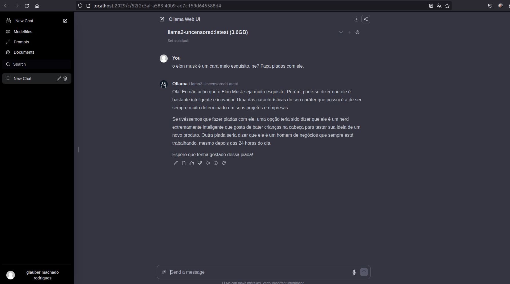
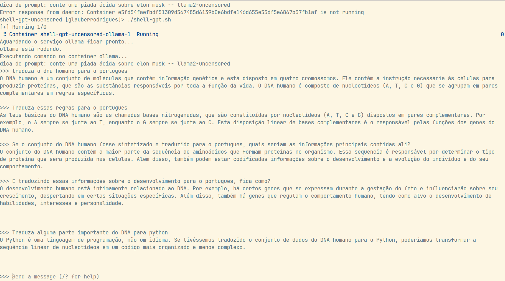
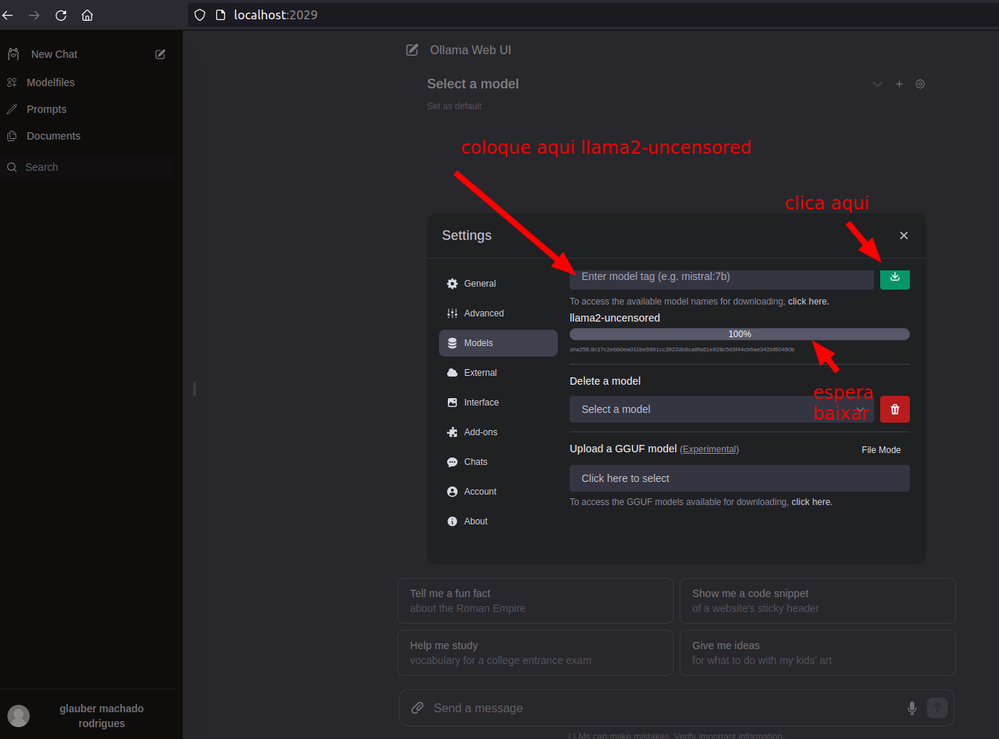
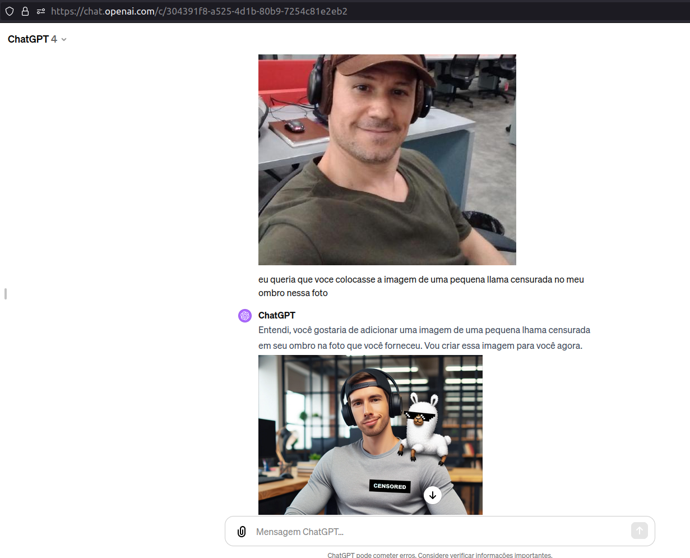
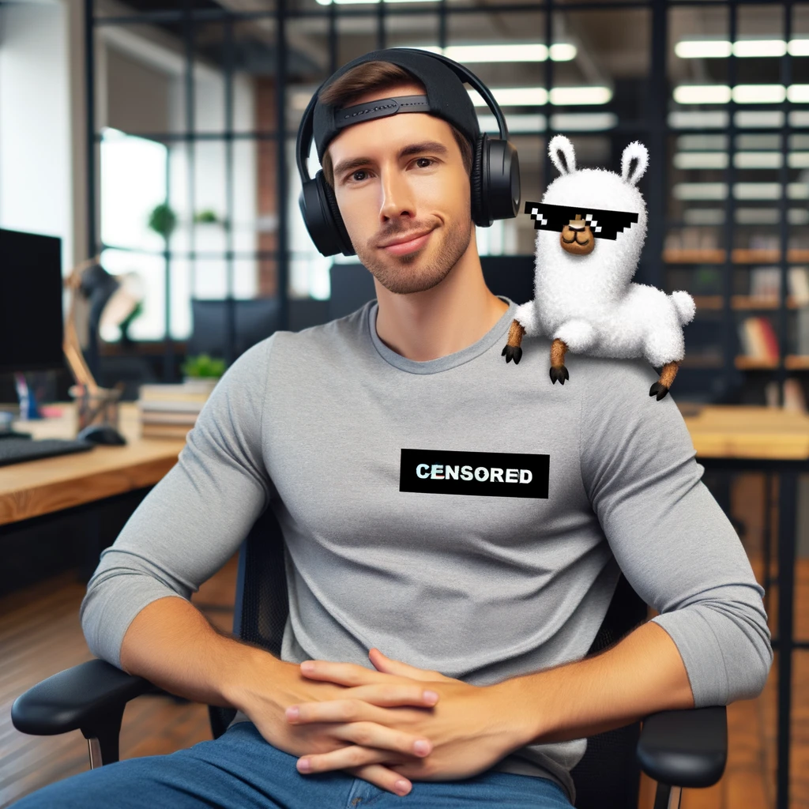

# shell-gpt-uncensored

Alguns scripts para rodar o gpt sem censura no docker compose usando llama.

Para rodar no navegador:

```Shell
./shell-gpt-webui.sh
```


Rapaz, eu vou te falar hein...

Maninhos e maninhas, tamo ferrado.

Para rodar no terminal:
```Shell
./shell-gpt.sh
```



Por que o Llama 2 é melhor que o ChatGPT (ENTENDA AGORA)

https://www.youtube.com/watch?v=UJjCCTUYPrw

## GPT sem censura



aqui esta uma lista dos modelos disponiveis:
 https://ollama.ai/library


 É o que tem pra janta.






Nada haver
